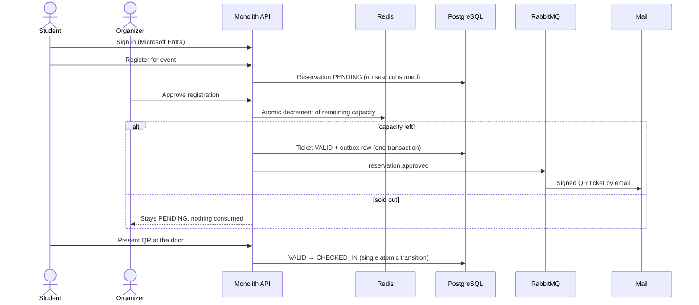
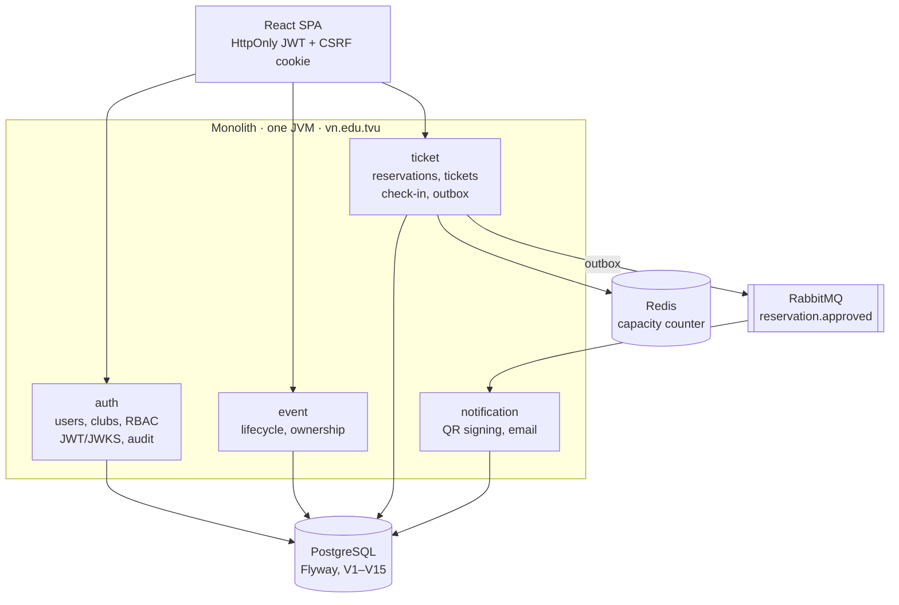
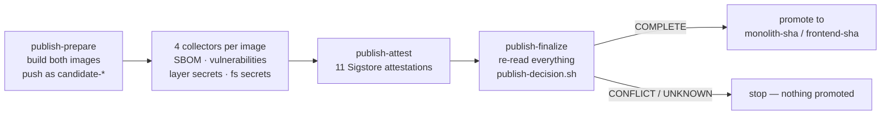

# TVU Event & Ticket

[](https://github.com/trhlow/TVU-Event-Ticket/actions/workflows/ci.yml)
[](https://github.com/trhlow/TVU-Event-Ticket/actions/workflows/codeql.yml)
[](backend/pom.xml)
[](backend/pom.xml)
[](frontend/package.json)

**Live: [evts.id.vn](https://evts.id.vn)** · [Tiếng Việt](README.vi.md)

Event management and e-ticketing for the student clubs of Tra Vinh University. Clubs publish events,
students register with their university account, organizers approve within a fixed capacity, and every
approved seat becomes a cryptographically signed QR ticket that can be scanned exactly once at the door.

**Seats cannot be oversold.** That single guarantee — held under concurrent approval, verified by a load
test that approves 500 registrations against 100 seats — is what most of this system's design exists to
protect.

---

## Contents

- [The core flow](#the-core-flow)
- [What each role can do](#what-each-role-can-do)
- [Architecture](#architecture)
- [Quick start](#quick-start)
- [Configuration](#configuration)
- [Testing](#testing)
- [Release pipeline](#release-pipeline)
- [Deployment](#deployment)
- [Design decisions](#design-decisions)
- [Repository layout](#repository-layout)
- [Documentation](#documentation)

## The core flow



The decisive detail: **approval consumes inventory, submission does not.** A student pressing "register"
never holds a seat, so a queue of pending registrations can be arbitrarily long without affecting whoever
gets in.

## What each role can do

| | Student | Organizer | Super Admin |
|---|---|---|---|
| Sign-in method | Microsoft Entra | Mailed one-time code | Mailed one-time code |
| Browse and register for events | ✅ | — | — |
| View own tickets and QR | ✅ | — | — |
| Create, open, close, delete events | — | ✅ (own club) | — |
| Approve / reject registrations | — | ✅ (own club) | — |
| Attendee list, CSV export, check-in | — | ✅ (own club) | — |
| Club dashboard and statistics | — | ✅ (own club) | ✅ (read-only, all clubs) |
| Manage clubs and organizer accounts | — | — | ✅ |
| Verify a student's MSSV | — | — | ✅ |
| Read the audit log | — | — | ✅ |

Super Admin is **read-only across club scope by design**: it administers accounts and reads aggregates,
but every club-scoped route answers `403`. This is enforced in `SecurityConfig` and independently again
in the services.

## Architecture

One deployable Spring Boot application, internally split into four features that talk through DTOs and
domain events rather than each other's repositories.



`MonolithApplication` is the only `@SpringBootApplication`; each feature is pulled in through its own
`*FeatureConfiguration` that scans only its package. `vn.edu.tvu.monolith` is the composition root and
the single place allowed to depend on two features at once.

**Why a monolith?** The system was originally five services with a database each. That split made
foreign keys impossible, turned every cross-feature read into a network call, and cost five runtimes on
a free tier. It was consolidated in July 2026; migration `V7` finally added the foreign keys the old
layout had ruled out. No URL the frontend calls changed.

### Stack

| Layer | Technology |
|---|---|
| Backend | Java 25, Spring Boot 4.0, Spring Security (OAuth2 resource server), Spring Data JPA, MapStruct |
| Database | PostgreSQL 18, Flyway migrations, Hibernate `ddl-auto: validate` |
| Cache / counter | Redis 7.4 |
| Messaging | RabbitMQ 4.2 (transactional outbox → notification) |
| Frontend | React 19, TypeScript 6, Vite 8, Tailwind CSS 4, React Router, Recharts, MSAL |
| Tests | JUnit 5, Testcontainers, AssertJ · Vitest, React Testing Library |
| Ops | Docker Compose, Caddy 2.10, Actuator + Prometheus, GitHub Actions, CodeQL |

## Quick start

**Prerequisites:** Docker Desktop, JDK 25, Maven 3.9+, Node.js 24 (see `frontend/.nvmrc`).

```bash
git clone https://github.com/trhlow/TVU-Event-Ticket.git
cd TVU-Event-Ticket

# 1. Backend + PostgreSQL, Redis, RabbitMQ and a local mail inbox.
#    --wait returns only once every healthcheck passes.
cd backend/infra
docker compose -f docker-compose.monolith.yml up -d --build --wait

# 2. Frontend dev server against that stack.
cd ../../frontend
npm ci
cp .env.example .env
npm run dev
```

| Service | URL |
|---|---|
| API | http://localhost:8080/api |
| API docs (Swagger UI) | http://localhost:8080/swagger-ui.html |
| Frontend dev server | http://localhost:5173 |
| Mailpit (catches every outgoing mail) | http://localhost:8025 |
| RabbitMQ management | http://localhost:15672 |

Tear down with `docker compose -f docker-compose.monolith.yml down` (add `-v` to drop the database
volume too).

Prefer running the backend outside Docker?

```bash
cd backend
mvn -pl monolith -am spring-boot:run    # needs the infra containers up
```

> **JDK note.** The Maven enforcer requires `[25,26)`. If your default `JAVA_HOME` points elsewhere,
> override it for the command rather than changing it globally.

## Configuration

The frontend reads `VITE_*` variables; start from `frontend/.env.example`.

| Variable | Purpose |
|---|---|
| `VITE_API_BASE_URL` | Backend base URL — must include `/api` |
| `VITE_APP_ENV` | `development` \| `production` |
| `VITE_AUTH_PROVIDER` | `microsoft` \| `devstub` (dev only) |
| `VITE_MICROSOFT_*` | MSAL client / tenant / redirect URI |

Startup validation (`src/lib/env.ts`) refuses to render on an unsafe combination — `devstub` plus
`production` shows a configuration-error screen instead of quietly falling back to something insecure.
Never put a secret in a `VITE_*` variable: everything with that prefix is bundled into public JS.

The backend uses profiles: `application-dev.yml` assumes localhost, `application-prod.yml` reads every
value from the environment with **no fallback defaults**, so a missing production secret fails at boot
instead of silently starting with a development value.

## Testing

```bash
# Backend — 76 test classes, integration tests on Testcontainers
cd backend
mvn clean verify
mvn -pl monolith -am test -Dtest=TicketReservationServiceTest   # one class

# Frontend — 105 tests across 20 files
cd frontend
npm run lint && npm run typecheck && npm run test && npm run build
```

CI runs both halves on every push and pull request, path-filtered so a frontend-only change does not
rebuild the backend. It also runs CodeQL for Java and TypeScript, a dependency review, and two guard
checks on the production bundle: no committed `.env` file, and no dev-stub or demo-account strings.

**The no-overbooking load test is deliberately not in CI** — it needs a live stack and takes minutes.
Run it by hand when touching the reservation path:

```bash
cd backend/load-test && ./run.sh
```

It creates an event with 100 seats, submits 500 registrations, approves all 500 concurrently, and
requires exactly 100 approved tickets, zero remaining capacity and no unexpected status code.

## Release pipeline

**Build once in CI, deploy by verified tag.** The production host no longer builds anything; it pulls
images that CI has already scanned and signed. Nothing reaches a release tag on evidence that was not
independently re-read from the registry.



| Stage | What it produces |
|---|---|
| Collectors | Syft SBOM, Trivy vulnerability scan against a tracked ignore policy, Trivy secret scan per layer and over the flattened filesystem, and a real Flyway inventory obtained by running the migrations against a throwaway PostgreSQL |
| Attestation | 11 Sigstore-signed attestations — 8 per-kind reports, 2 evidence-set carriers, 1 release marker — created through GitHub's OIDC identity and attached in the registry |
| Decision | `publish-decision.sh` re-reads the registry from scratch, re-verifies every signature with `gh attestation verify`, **recomputes each scan verdict from its counts rather than trusting the declared outcome**, and returns `COMPLETE`, `PARTIAL`, `CONFLICT` or `UNKNOWN` |
| Promotion | Only on `COMPLETE`. Promotion re-tags the existing manifest, so the final marker is byte-identical to the prepared one and inherits its attestation |

Two rules run through the whole design:

- **Absence must be observed, never inferred.** "I could not check" and "I checked and it failed" are
  different answers and are never collapsed into one. A missing library raises; it does not quietly
  report a document as invalid.
- **The decision never trusts a job's memory of what it pushed.** Every fact is re-read from the
  registry in a separate job with no shared state.

`publish-decision.sh` is itself covered by mutation testing (8 parallel shards): each mutation is
applied to a pristine copy and the suite must fail, so a check that cannot fail is caught as a bug.

## Deployment

Production runs behind Caddy, which terminates TLS and is the only publicly exposed process.

```bash
git checkout --detach <sha-that-CI-published>
cd backend/infra/production && bash scripts/deploy.sh
```

`deploy.sh` runs preflight, logs in to GHCR, pulls `monolith-<sha>` / `frontend-<sha>`, starts the
datastores, **takes a verified PostgreSQL backup before the migration**, runs Flyway as the schema owner
in a one-shot container, recreates the application containers, restarts Caddy and finishes with a smoke
test over public HTTPS. It writes its state marker only after all of that passes, which is what
`rollback.sh` relies on.

The safety property is worth stating plainly: **a commit whose CI failed has no image tag**, so
`compose pull` fails and there is nothing to deploy. The gate is not "CI was green" but "this exact
commit produced a signed, verified release".

First-time setup, secret generation, backup and rollback are in
[backend/docs/FIRST_DEPLOY_RUNBOOK_VI.md](backend/docs/FIRST_DEPLOY_RUNBOOK_VI.md) (Vietnamese).
Topology and cost guidance are in [backend/docs/DEPLOYMENT.md](backend/docs/DEPLOYMENT.md), day-two
operations in [backend/docs/OPERATIONS.md](backend/docs/OPERATIONS.md).

## Design decisions

Rules that are load-bearing. Breaking one is a correctness bug, not a style preference.

1. **Approval reserves inventory, submission does not.** Registration writes a `PENDING` row and consumes
   nothing. Approval performs the atomic Redis decrement; a negative result leaves the reservation pending
   and the seat untouched.
2. **Overbooking has two independent guards.** Redis is the fast atomic counter; PostgreSQL optimistic
   locking is the second line of defence if Redis is wrong. A scheduled job reconciles the counter back
   from PostgreSQL, which is always the source of truth.
3. **Ticket and outbox row are written in one transaction.** Notification delivery can then fail, retry
   through a delayed queue, and still never lose a ticket email — and never send one for a seat that was
   not actually granted.
4. **Identity is an account, not an IP address.** One registration per event per account, enforced by a
   database constraint plus an idempotency key. Rate limiting only mitigates abuse; it does not define
   uniqueness.
5. **Each role is bound to exactly one sign-in method.** Students hold university Entra accounts; clubs
   do not, and reach their shared account through a mailed one-time code. Binding the method per account
   stops either flow from becoming a way into the other's accounts. A verified browser is remembered for
   30 days, and the device token is rotated so exactly one concurrent request can win.
6. **RBAC is scoped by club, from the token.** Organizer queries take the club identifier from the
   authenticated principal. A client-supplied club id is never trusted.
7. **QR tickets are signed and single-use.** Check-in is one atomic `VALID → CHECKED_IN` transition.
8. **Migrations are immutable.** Add a version; never edit a shipped one. `V7` declares no `ON DELETE`
   behaviour, so deleting a referenced row fails loudly rather than cascading away ticket history.
9. **Audit is written in-process and transactionally** via `shared.audit.AuditRecorder`. The broker
   carries `reservation.approved` and nothing else.

## Repository layout

```
backend/
  monolith/          Spring Boot application — auth, event, ticket, notification, shared, monolith
  infra/             Docker Compose for local dev; production/ holds Caddy + compose + scripts
  load-test/         Manual concurrent-approval capacity test
  docs/              Deployment, operations, security requirements, frontend contract
frontend/
  src/               React application, design tokens in src/index.css
docs/                Close-out notes, course report, frontend implementation status
.github/workflows/   CI, CodeQL, production deploy
.github/scripts/     Release pipeline — collectors, registry readers, publish-decision.sh
.github/contracts/   JSON Schemas and fixtures the decision is validated against
```

## Documentation

| Document | Covers |
|---|---|
| [Backend guide](backend/README.md) | Package conventions, runtime components, build and test commands |
| [Frontend guide](frontend/README.md) | Environment variables, auth model, design system, production safety |
| [API contract](backend/docs/BACKEND_STATUS_FOR_FRONTEND.md) | Endpoint shapes and known gaps |
| [Security requirements](backend/docs/BACKEND_SECURITY_REQUIREMENTS.md) | Threats addressed and outstanding items |
| [Production deployment](backend/docs/PRODUCTION_DEPLOYMENT_VI.md) | Step-by-step release, backup and rollback |
| [Operations](backend/docs/OPERATIONS.md) | Monitoring, restore and incident procedures |
| [Project close-out](docs/PROJECT_CLOSEOUT.md) | Delivered scope, verification evidence, remaining risks |
| [Course report](docs/BAO_CAO_KET_THUC_MON.md) | End-of-course report: scope, architecture, results, lessons (Vietnamese) |
| [First deploy runbook](backend/docs/FIRST_DEPLOY_RUNBOOK_VI.md) | Server preparation through first release, step by step (Vietnamese) |
| [Course report](docs/BAO_CAO_KET_THUC_MON.md) | End-of-course report: scope, architecture, results, lessons (Vietnamese) |
| [First deploy runbook](backend/docs/FIRST_DEPLOY_RUNBOOK_VI.md) | Server preparation through first release, step by step (Vietnamese) |
| [Original proposal](decuongTVUEventTicket.md) | The capstone brief this was built against (Vietnamese) |

---

Capstone project, Tra Vinh University.
