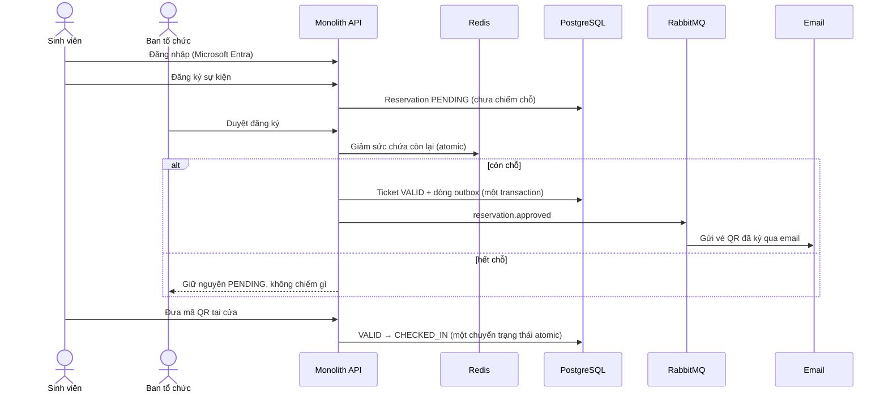
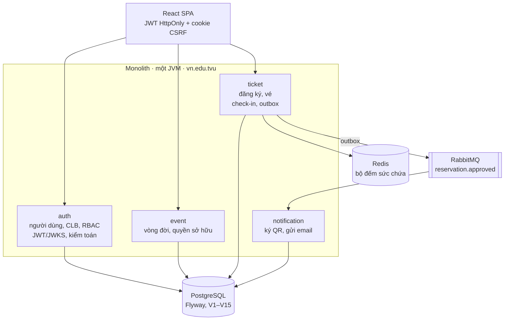
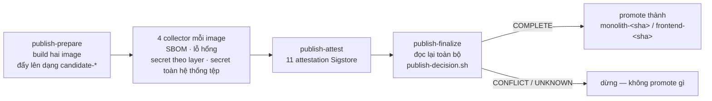

# TVU Event & Ticket

[](https://github.com/trhlow/TVU-Event-Ticket/actions/workflows/ci.yml)
[](https://github.com/trhlow/TVU-Event-Ticket/actions/workflows/codeql.yml)
[](backend/pom.xml)
[](backend/pom.xml)
[](frontend/package.json)

**Đang chạy: [evts.id.vn](https://evts.id.vn)** · [English](README.md)

Hệ thống quản lý sự kiện và vé điện tử cho các câu lạc bộ sinh viên Trường Đại học Trà Vinh. CLB đăng
sự kiện, sinh viên đăng ký bằng tài khoản trường, ban tổ chức duyệt trong giới hạn sức chứa, và mỗi chỗ
được duyệt trở thành một vé QR có chữ ký, chỉ quét được đúng một lần tại cửa.

**Không thể bán vượt số chỗ.** Đó là bảo đảm duy nhất mà phần lớn thiết kế của hệ thống này tồn tại để
bảo vệ — đã được kiểm chứng bằng load test: duyệt đồng thời 500 đăng ký trên 100 chỗ.

---

## Mục lục

- [Luồng chính](#luồng-chính)
- [Quyền của từng vai trò](#quyền-của-từng-vai-trò)
- [Kiến trúc](#kiến-trúc)
- [Chạy thử nhanh](#chạy-thử-nhanh)
- [Cấu hình](#cấu-hình)
- [Kiểm thử](#kiểm-thử)
- [Quy trình phát hành](#quy-trình-phát-hành)
- [Triển khai](#triển-khai)
- [Các quyết định thiết kế](#các-quyết-định-thiết-kế)
- [Cấu trúc mã nguồn](#cấu-trúc-mã-nguồn)
- [Tài liệu](#tài-liệu)

## Luồng chính



Chi tiết quyết định: **duyệt mới chiếm chỗ, gửi đăng ký thì không.** Sinh viên bấm "đăng ký" không hề
giữ chỗ nào, nên hàng chờ dài bao nhiêu cũng không ảnh hưởng tới ai được vào.

## Quyền của từng vai trò

| | Sinh viên | Ban tổ chức | Super Admin |
|---|---|---|---|
| Cách đăng nhập | Microsoft Entra | Mã một lần qua email | Mã một lần qua email |
| Xem và đăng ký sự kiện | ✅ | — | — |
| Xem vé và mã QR của mình | ✅ | — | — |
| Tạo, mở, đóng, xoá sự kiện | — | ✅ (CLB của mình) | — |
| Duyệt / từ chối đăng ký | — | ✅ (CLB của mình) | — |
| Danh sách tham dự, xuất CSV, check-in | — | ✅ (CLB của mình) | — |
| Bảng điều khiển và thống kê CLB | — | ✅ (CLB của mình) | ✅ (chỉ đọc, mọi CLB) |
| Quản lý CLB và tài khoản ban tổ chức | — | — | ✅ |
| Xác minh MSSV của sinh viên | — | — | ✅ |
| Đọc nhật ký kiểm toán | — | — | ✅ |

Super Admin **cố ý chỉ được đọc ở phạm vi CLB**: nó quản trị tài khoản và đọc số liệu tổng hợp, nhưng
mọi route thuộc phạm vi CLB đều trả `403`. Điều này được ràng buộc ở `SecurityConfig` và một lần nữa,
độc lập, ở tầng service.

## Kiến trúc

Một ứng dụng Spring Boot triển khai duy nhất, bên trong chia thành bốn feature giao tiếp với nhau qua
DTO và domain event chứ không đụng vào repository của nhau.



`MonolithApplication` là `@SpringBootApplication` duy nhất; mỗi feature được nạp qua
`*FeatureConfiguration` riêng chỉ quét đúng package của nó. `vn.edu.tvu.monolith` là composition root
và là nơi duy nhất được phép phụ thuộc vào hai feature cùng lúc.

**Vì sao là monolith?** Ban đầu hệ thống là năm service, mỗi service một database. Cách chia đó khiến
khoá ngoại không thể tồn tại, biến mọi truy vấn liên feature thành một lời gọi mạng, và tốn năm runtime
trên gói miễn phí. Hệ thống được gộp lại vào tháng 7/2026; migration `V7` mới thêm được những khoá ngoại
mà kiến trúc cũ đã loại trừ. Không một URL nào frontend đang gọi bị thay đổi.

### Công nghệ

| Tầng | Công nghệ |
|---|---|
| Backend | Java 25, Spring Boot 4.0, Spring Security (OAuth2 resource server), Spring Data JPA, MapStruct |
| Cơ sở dữ liệu | PostgreSQL 18, Flyway, Hibernate `ddl-auto: validate` |
| Cache / bộ đếm | Redis 7.4 |
| Hàng đợi | RabbitMQ 4.2 (transactional outbox → notification) |
| Frontend | React 19, TypeScript 6, Vite 8, Tailwind CSS 4, React Router, Recharts, MSAL |
| Kiểm thử | JUnit 5, Testcontainers, AssertJ · Vitest, React Testing Library |
| Vận hành | Docker Compose, Caddy 2.10, Actuator + Prometheus, GitHub Actions, CodeQL |

## Chạy thử nhanh

**Yêu cầu:** Docker Desktop, JDK 25, Maven 3.9+, Node.js 24 (xem `frontend/.nvmrc`).

```bash
git clone https://github.com/trhlow/TVU-Event-Ticket.git
cd TVU-Event-Ticket

# 1. Backend + PostgreSQL, Redis, RabbitMQ và một hộp thư cục bộ.
#    --wait chỉ trả về khi mọi healthcheck đã xanh.
cd backend/infra
docker compose -f docker-compose.monolith.yml up -d --build --wait

# 2. Frontend dev server trỏ vào stack đó.
cd ../../frontend
npm ci
cp .env.example .env
npm run dev
```

| Dịch vụ | URL |
|---|---|
| API | http://localhost:8080/api |
| Tài liệu API (Swagger UI) | http://localhost:8080/swagger-ui.html |
| Frontend dev server | http://localhost:5173 |
| Mailpit (bắt mọi email gửi đi) | http://localhost:8025 |
| RabbitMQ management | http://localhost:15672 |

Dọn bằng `docker compose -f docker-compose.monolith.yml down` (thêm `-v` để xoá cả volume database).

Muốn chạy backend ngoài Docker:

```bash
cd backend
mvn -pl monolith -am spring-boot:run    # cần các container hạ tầng đang chạy
```

> **Lưu ý JDK.** Maven enforcer yêu cầu `[25,26)`. Nếu `JAVA_HOME` mặc định trỏ chỗ khác, hãy override
> cho riêng lệnh đó thay vì đổi toàn cục.

## Cấu hình

Frontend đọc các biến `VITE_*`; bắt đầu từ `frontend/.env.example`.

| Biến | Ý nghĩa |
|---|---|
| `VITE_API_BASE_URL` | URL gốc của backend — phải có `/api` |
| `VITE_APP_ENV` | `development` \| `production` |
| `VITE_AUTH_PROVIDER` | `microsoft` \| `devstub` (chỉ dev) |
| `VITE_MICROSOFT_*` | client / tenant / redirect URI của MSAL |

Kiểm tra lúc khởi động (`src/lib/env.ts`) từ chối render nếu tổ hợp cấu hình không an toàn — `devstub`
cộng `production` sẽ hiện màn hình báo lỗi cấu hình thay vì âm thầm chạy bằng thứ kém an toàn. **Không
bao giờ** đặt secret vào biến `VITE_*`: mọi thứ mang tiền tố đó đều bị đóng gói vào JS công khai.

Backend dùng profile: `application-dev.yml` giả định localhost, `application-prod.yml` đọc mọi giá trị
từ biến môi trường **không có giá trị mặc định**, nên thiếu một secret production là hỏng ngay lúc khởi
động thay vì lặng lẽ chạy bằng giá trị của môi trường dev.

## Kiểm thử

```bash
# Backend — 76 lớp test, test tích hợp chạy trên Testcontainers
cd backend
mvn clean verify
mvn -pl monolith -am test -Dtest=TicketReservationServiceTest   # một lớp

# Frontend — 105 test trong 20 file
cd frontend
npm run lint && npm run typecheck && npm run test && npm run build
```

CI chạy cả hai nửa trên mọi push và pull request, có lọc theo đường dẫn nên thay đổi chỉ ở frontend
không phải build lại backend. CI còn chạy CodeQL cho Java và TypeScript, dependency review, và hai chốt
kiểm tra bundle production: không có file `.env` bị commit, và không có chuỗi nào của dev-stub hay tài
khoản demo.

**Load test chống bán vượt cố ý không nằm trong CI** — nó cần một stack sống và mất vài phút. Chạy tay
mỗi khi đụng vào đường đăng ký:

```bash
cd backend/load-test && ./run.sh
```

Nó tạo một sự kiện 100 chỗ, gửi 500 đăng ký, duyệt đồng thời cả 500, và bắt buộc kết quả phải đúng 100
vé được duyệt, sức chứa còn lại bằng 0, không có mã trạng thái bất ngờ nào.

## Quy trình phát hành

**Build một lần trong CI, triển khai theo tag đã kiểm chứng.** Máy chủ production không còn build gì
nữa; nó kéo về image mà CI đã quét và ký. Không có gì được gắn tag phát hành dựa trên bằng chứng chưa
được đọc lại độc lập từ registry.



| Giai đoạn | Sinh ra cái gì |
|---|---|
| Collector | SBOM bằng Syft, quét lỗ hổng bằng Trivy theo file chính sách bỏ qua có version hoá, quét secret bằng Trivy theo từng layer và trên hệ thống tệp đã làm phẳng, và một bản kê Flyway thật lấy bằng cách chạy migration trên một PostgreSQL dùng một lần |
| Attestation | 11 attestation ký bằng Sigstore — 8 báo cáo theo loại, 2 evidence-set, 1 release marker — tạo bằng danh tính OIDC của GitHub và gắn kèm trong registry |
| Quyết định | `publish-decision.sh` đọc lại registry từ đầu, xác minh lại mọi chữ ký bằng `gh attestation verify`, **tự tính lại verdict của từng lần quét từ `counts` chứ không tin `declaredOutcome`**, rồi trả về `COMPLETE`, `PARTIAL`, `CONFLICT` hoặc `UNKNOWN` |
| Promote | Chỉ khi `COMPLETE`. Promote là gắn thêm tag cho chính manifest đã có, nên final marker trùng từng byte với prepared marker và thừa hưởng luôn attestation của nó |

Hai nguyên tắc xuyên suốt thiết kế:

- **Sự vắng mặt phải được quan sát, không được suy diễn.** "Tôi không kiểm tra được" và "tôi đã kiểm tra
  và nó sai" là hai câu trả lời khác nhau, không bao giờ được gộp làm một. Thiếu thư viện thì phải báo
  lỗi môi trường, không được lặng lẽ kết luận tài liệu không hợp lệ.
- **Quyết định không bao giờ tin vào trí nhớ của job đã đẩy.** Mọi dữ kiện đều được đọc lại từ registry
  trong một job riêng, không chia sẻ trạng thái.

Bản thân `publish-decision.sh` được phủ bằng mutation testing (8 shard song song): mỗi đột biến được áp
lên một bản sao sạch và bộ test bắt buộc phải fail — nhờ vậy một phép kiểm tra không thể fail sẽ bị phát
hiện như một lỗi.

## Triển khai

Production chạy sau Caddy, nơi kết thúc TLS và là tiến trình duy nhất lộ ra ngoài.

```bash
git checkout --detach <sha-mà-CI-đã-publish>
cd backend/infra/production && bash scripts/deploy.sh
```

`deploy.sh` chạy preflight, đăng nhập GHCR, kéo `monolith-<sha>` / `frontend-<sha>`, khởi động các
datastore, **tạo bản sao lưu PostgreSQL đã verify trước khi migrate**, chạy Flyway với quyền chủ schema
trong một container dùng một lần, tạo lại container ứng dụng, restart Caddy và kết thúc bằng smoke test
qua HTTPS công khai. Nó chỉ ghi mốc trạng thái sau khi tất cả những bước đó đã qua — đó cũng là mốc mà
`rollback.sh` dựa vào.

Tính chất an toàn đáng nói thẳng: **commit nào CI đỏ thì không có tag image**, nên `compose pull` sẽ
fail và không có gì để deploy. Cổng chặn không phải "CI đã xanh" mà là "chính commit này đã tạo ra một
bản phát hành đã ký và đã được kiểm chứng".

Thiết lập lần đầu, sinh secret, sao lưu và rollback nằm ở
[backend/docs/FIRST_DEPLOY_RUNBOOK_VI.md](backend/docs/FIRST_DEPLOY_RUNBOOK_VI.md). Kiến trúc hạ tầng và
chi phí ở [backend/docs/DEPLOYMENT.md](backend/docs/DEPLOYMENT.md), vận hành hằng ngày ở
[backend/docs/OPERATIONS.md](backend/docs/OPERATIONS.md).

## Các quyết định thiết kế

Những quy tắc chịu lực. Phá một trong số đó là lỗi đúng-sai, không phải khác biệt phong cách.

1. **Duyệt mới chiếm chỗ, gửi đăng ký thì không.** Đăng ký ghi một dòng `PENDING` và không chiếm gì.
   Duyệt mới thực hiện lệnh giảm atomic trên Redis; nếu kết quả âm thì đăng ký giữ nguyên trạng thái chờ
   và chỗ ngồi không bị đụng tới.
2. **Chống bán vượt có hai lớp độc lập.** Redis là bộ đếm atomic nhanh; optimistic locking của PostgreSQL
   là lớp thứ hai nếu Redis sai. Một job định kỳ đối soát bộ đếm ngược lại từ PostgreSQL — đây luôn là
   nguồn sự thật.
3. **Vé và dòng outbox được ghi trong cùng một transaction.** Nhờ đó việc gửi thông báo có thể thất bại,
   thử lại qua hàng đợi trễ, mà không bao giờ mất email vé — và cũng không bao giờ gửi vé cho một chỗ
   chưa thực sự được cấp.
4. **Danh tính là tài khoản, không phải địa chỉ IP.** Mỗi tài khoản chỉ đăng ký một lần cho một sự kiện,
   ràng buộc bằng constraint ở database cộng một idempotency key. Rate limit chỉ giảm thiểu lạm dụng,
   nó không định nghĩa tính duy nhất.
5. **Mỗi vai trò gắn với đúng một cách đăng nhập.** Sinh viên có tài khoản Entra của trường; CLB thì
   không, và dùng tài khoản dùng chung qua mã một lần gửi email. Ràng buộc phương thức theo từng tài
   khoản chặn việc luồng này trở thành cửa vào tài khoản của luồng kia. Trình duyệt đã xác minh được nhớ
   30 ngày, và token thiết bị được xoay vòng để chỉ đúng một request đồng thời thắng.
6. **RBAC giới hạn theo CLB, lấy từ token.** Truy vấn của ban tổ chức lấy mã CLB từ principal đã xác
   thực. Mã CLB do client gửi lên không bao giờ được tin.
7. **Vé QR có chữ ký và chỉ dùng một lần.** Check-in là một chuyển trạng thái atomic `VALID → CHECKED_IN`.
8. **Migration là bất biến.** Thêm version mới; không bao giờ sửa cái đã phát hành. `V7` không khai báo
   hành vi `ON DELETE`, nên xoá một dòng đang được tham chiếu sẽ báo lỗi rõ ràng thay vì xoá lan sang cả
   lịch sử vé.
9. **Kiểm toán được ghi trong tiến trình và trong transaction** qua `shared.audit.AuditRecorder`. Broker
   chỉ mang `reservation.approved`, không mang gì khác.

## Cấu trúc mã nguồn

```
backend/
  monolith/          Ứng dụng Spring Boot — auth, event, ticket, notification, shared, monolith
  infra/             Docker Compose cho dev; production/ chứa Caddy + compose + scripts
  load-test/         Test sức chứa khi duyệt đồng thời, chạy tay
  docs/              Triển khai, vận hành, yêu cầu bảo mật, hợp đồng với frontend
frontend/
  src/               Ứng dụng React, design token trong src/index.css
docs/                Ghi chú tổng kết, báo cáo môn học, trạng thái frontend
.github/workflows/   CI, CodeQL, deploy production
.github/scripts/     Quy trình phát hành — collector, reader registry, publish-decision.sh
.github/contracts/   JSON Schema và fixture để kiểm chứng quyết định phát hành
```

## Tài liệu

| Tài liệu | Nội dung |
|---|---|
| [Hướng dẫn backend](backend/README.md) | Quy ước package, thành phần runtime, lệnh build và test |
| [Hướng dẫn frontend](frontend/README.md) | Biến môi trường, mô hình xác thực, design system, an toàn production |
| [Hợp đồng API](backend/docs/BACKEND_STATUS_FOR_FRONTEND.md) | Hình dạng endpoint và các điểm còn thiếu |
| [Yêu cầu bảo mật](backend/docs/BACKEND_SECURITY_REQUIREMENTS.md) | Mối đe doạ đã xử lý và hạng mục còn tồn |
| [Runbook deploy lần đầu](backend/docs/FIRST_DEPLOY_RUNBOOK_VI.md) | Từ chuẩn bị máy chủ tới lần phát hành đầu tiên |
| [Vận hành](backend/docs/OPERATIONS.md) | Giám sát, khôi phục và quy trình sự cố |
| [Tổng kết dự án](docs/PROJECT_CLOSEOUT.md) | Phạm vi đã giao, bằng chứng kiểm chứng, rủi ro còn lại |
| [Báo cáo kết thúc môn](docs/BAO_CAO_KET_THUC_MON.md) | Báo cáo môn học: phạm vi, kiến trúc, kết quả, bài học |
| [Sơ đồ UML & phân tích](SO_DO_UML_TVU_Event_Ticketing.md) | Use case, hoạt động, lớp, tuần tự, dòng dữ liệu, ERD và triển khai |
| [Đề cương gốc](decuongTVUEventTicket.md) | Đề cương đồ án mà hệ thống này được xây theo |

---

Đồ án môn học, Trường Đại học Trà Vinh.
