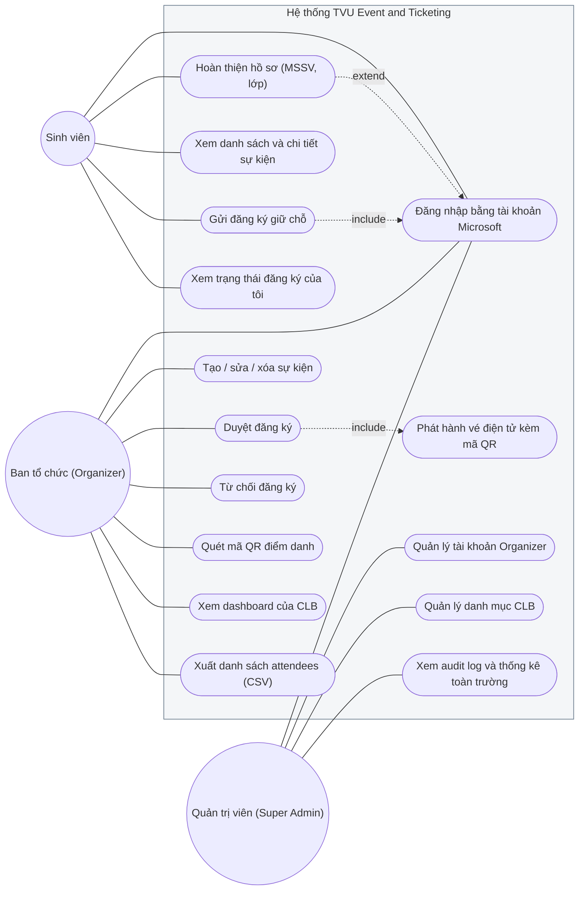
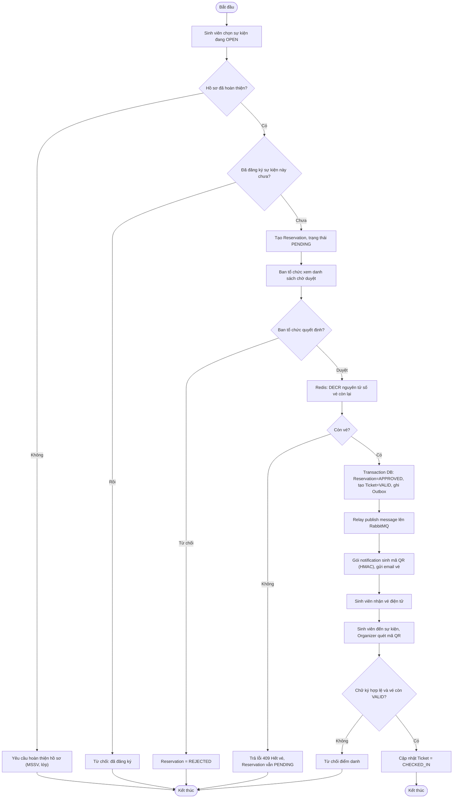
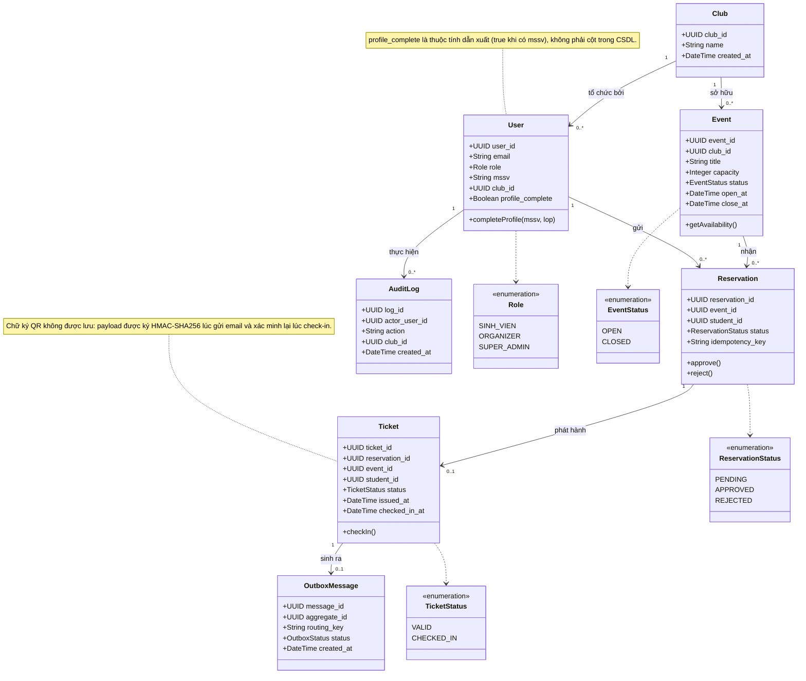
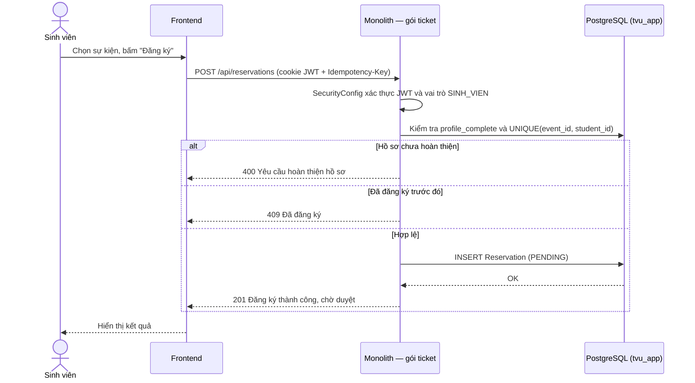
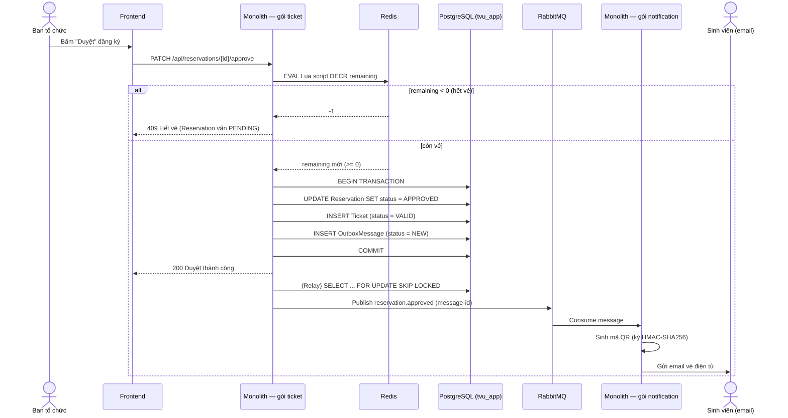
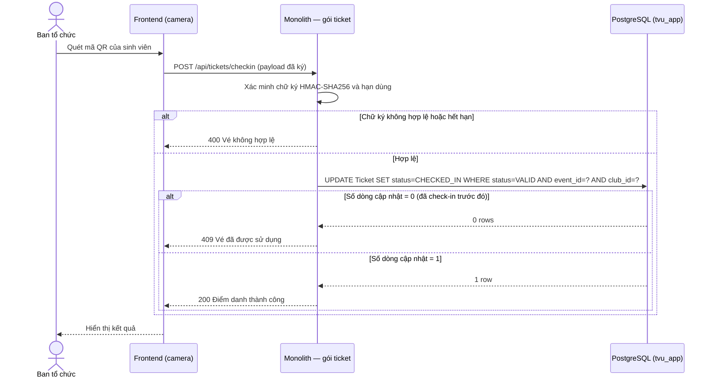
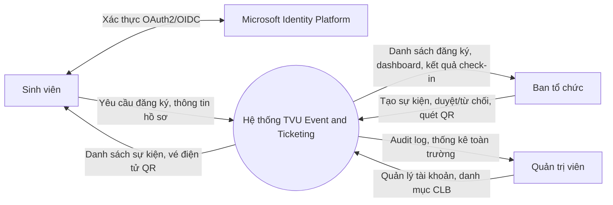
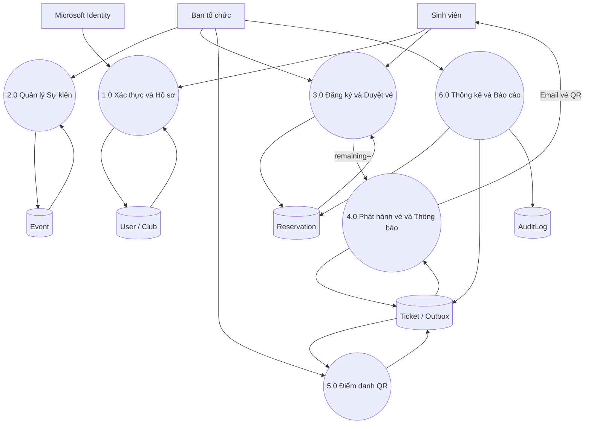
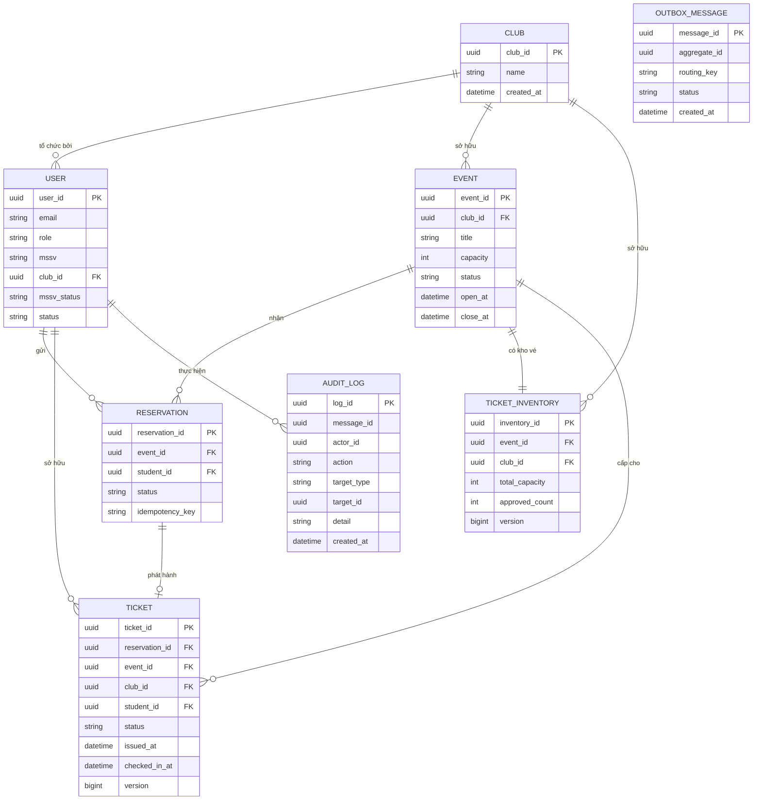
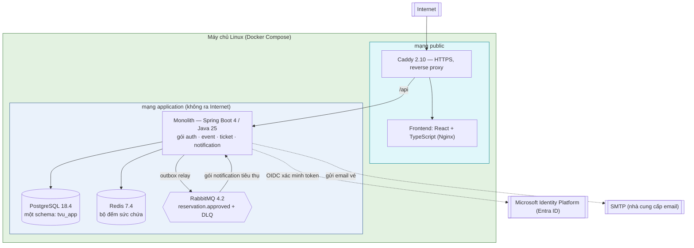

# Sơ đồ UML & Phân tích Hệ thống
## TVU Event & Ticketing Platform

_Tài liệu này tổng hợp các sơ đồ trực quan bổ trợ cho SRS: Use Case, Activity, Class, Sequence, DFD, ER và sơ đồ triển khai (Component/Deployment). Toàn bộ sơ đồ dùng cú pháp [Mermaid](https://mermaid.js.org) — có thể chỉnh sửa trực tiếp trong file `.md` này._

---

## 1. Sơ đồ Use Case

_Tác nhân: Sinh viên, Ban tổ chức (Organizer), Quản trị viên (Super Admin). Quan hệ `include`/`extend` thể hiện bằng đường nét đứt._

---

## 2. Sơ đồ Hoạt động (Activity Diagram)

_Luồng nghiệp vụ đầy đủ: gửi đăng ký → duyệt (giữ chỗ nguyên tử) → phát hành vé → điểm danh QR._

---

## 3. Sơ đồ Lớp (Class Diagram)

_Mô hình hóa các thực thể dữ liệu chính và quan hệ giữa chúng (tương ứng Mục 6 của SRS)._

---

## 4. Sơ đồ Tuần tự (Sequence Diagram)

### 4.1 UC-01 — Sinh viên gửi đăng ký giữ chỗ

### 4.2 UC-02 — Ban tổ chức duyệt đăng ký (giữ chỗ nguyên tử & phát vé)

### 4.3 UC-03 — Điểm danh bằng quét mã QR

---

## 5. Biểu đồ Dòng Dữ liệu (Data Flow Diagram — DFD)

### 5.1 Mức 0 — Sơ đồ ngữ cảnh (Context Diagram)

### 5.2 Mức 1 — Phân rã theo tiến trình nghiệp vụ

---

## 6. Sơ đồ Thực thể – Quan hệ (ER Diagram)

---

## 7. Sơ đồ Thành phần & Triển khai (Component/Deployment Diagram)

_Ánh xạ các thành phần đã bàn giao lên một máy chủ duy nhất chạy Docker Compose. Bản trước của sơ đồ này
vẽ năm microservice trên nhiều dịch vụ đám mây rời; kiến trúc đã hợp nhất thành một khối modular monolith
(xem `backend/monolith`) nên sơ đồ được vẽ lại theo `backend/infra/production/compose.yaml`._

**Ghi chú triển khai**

- Chỉ Caddy lộ ra Internet. PostgreSQL (5432), Redis (6379) và RabbitMQ (5672 / 15672) nằm trong mạng
  `application` và không publish cổng ra ngoài.
- Frontend và API dùng **cùng một origin** (`VITE_API_BASE_URL=/api`) nên cookie JWT `HttpOnly` hoạt động
  mà không cần cấu hình CORS liên miền.
- RabbitMQ chỉ còn mang `reservation.approved`. Nhật ký kiểm toán (audit) là lời gọi trong tiến trình,
  ghi cùng transaction với thao tác sinh ra nó — không đi qua broker.
