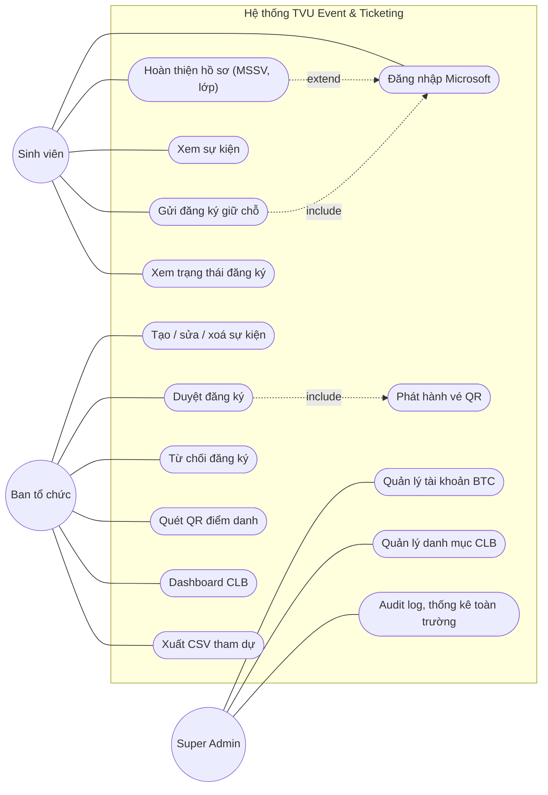
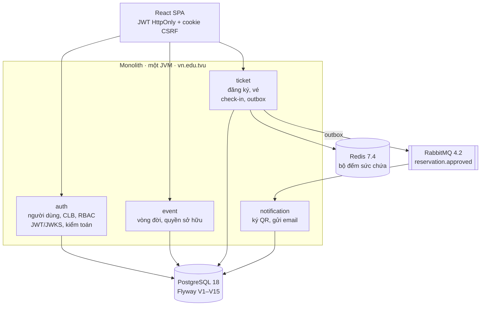
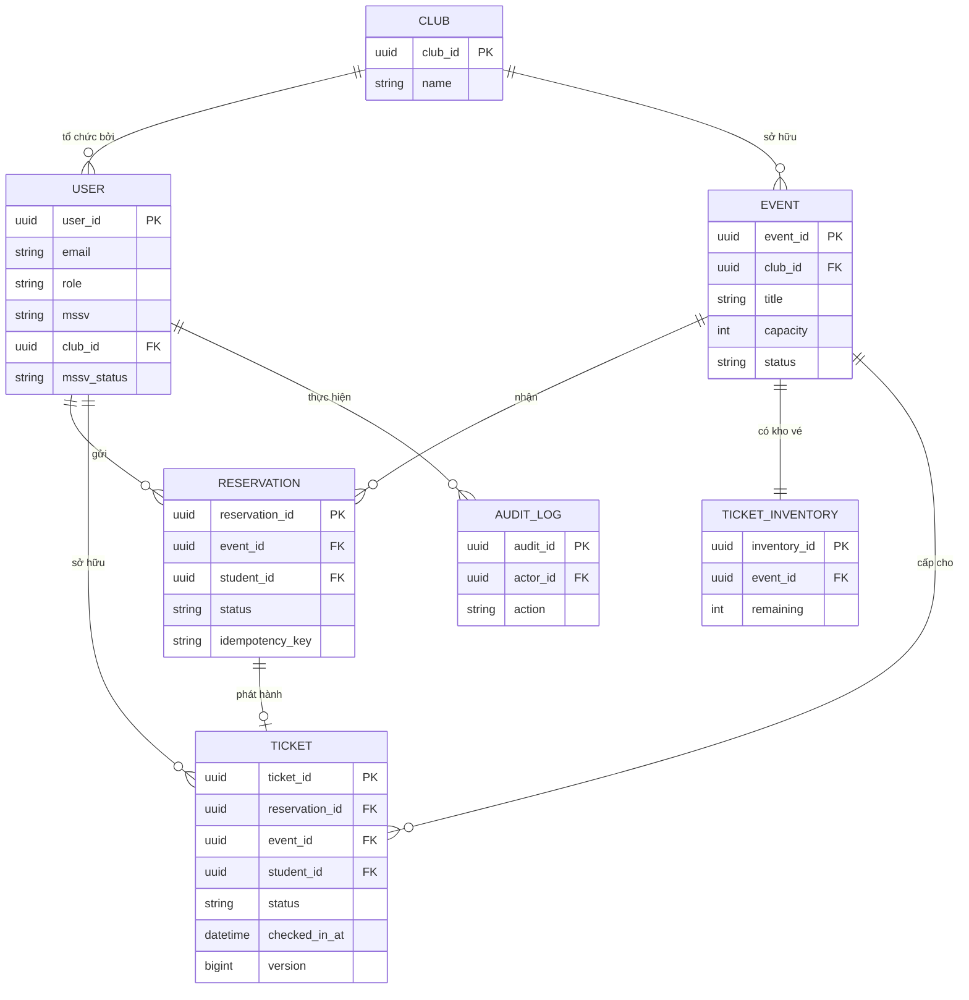
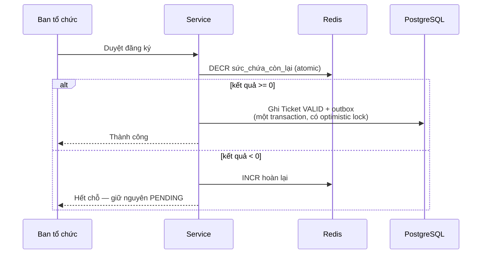
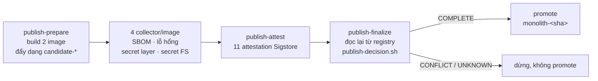
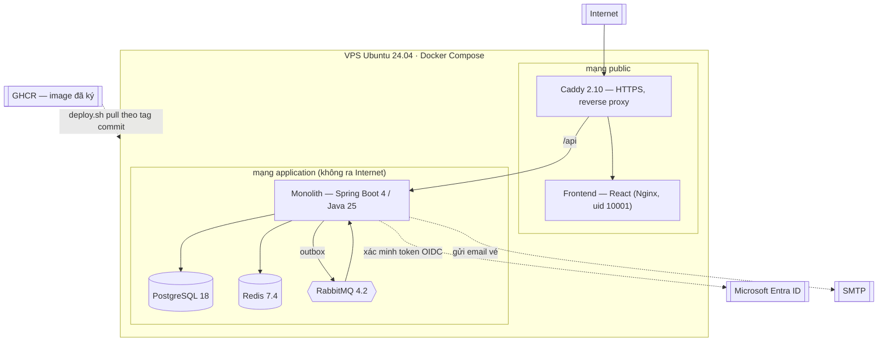

# Báo cáo kết thúc môn — TVU Event & Ticket

**Hệ thống quản lý sự kiện và vé điện tử cho câu lạc bộ sinh viên Trường Đại học Trà Vinh**

| | |
|---|---|
| Sản phẩm đang chạy | <https://evts.id.vn> |
| Mã nguồn | <https://github.com/trhlow/TVU-Event-Ticket> |
| Thời gian thực hiện | 01/07/2026 – 15/08/2026 |
| Trạng thái | Đã triển khai production, đang hoạt động |

---

## 1. Đặt vấn đề

Các câu lạc bộ sinh viên tổ chức sự kiện có giới hạn chỗ ngồi. Cách làm phổ biến hiện nay là Google
Form cộng một file Excel: ban tổ chức tự đếm, tự lọc trùng, tự gửi mail xác nhận, và điểm danh bằng cách
dò tên trên giấy. Cách đó có ba điểm yếu cụ thể:

1. **Không có ràng buộc sức chứa.** Form vẫn nhận đăng ký sau khi đã đủ chỗ; ban tổ chức phát hiện ra
   khi đã quá muộn và phải từ chối thủ công.
2. **Không có bằng chứng chống gian lận tại cửa.** Một ảnh chụp màn hình xác nhận có thể chuyển cho
   người khác, và cùng một xác nhận có thể dùng nhiều lần.
3. **Không có số liệu.** Tỉ lệ tham dự thực tế trên số đăng ký không được ghi nhận ở đâu.

Đề tài này xây dựng một hệ thống khép kín: sinh viên đăng ký bằng tài khoản trường → ban tổ chức duyệt
trong giới hạn sức chứa → hệ thống phát vé QR có chữ ký qua email → quét vé tại cửa, mỗi vé đúng một
lần → thống kê tự động.

### Yêu cầu chịu lực

Trong tất cả yêu cầu, có **một** yêu cầu quyết định phần lớn thiết kế:

> **Không được duyệt vượt quá số chỗ, kể cả khi nhiều người duyệt đồng thời.**

Đây là bài toán tương tranh thật, không phải yêu cầu hình thức. Hai thành viên ban tổ chức bấm "duyệt"
cùng lúc trên hai máy khác nhau, khi chỉ còn một chỗ, phải có đúng một người thành công.

---

## 2. Phạm vi đã thực hiện

### 2.1 Sơ đồ use case

Quan hệ đáng chú ý: **duyệt đăng ký `include` phát hành vé** — không có đường nào phát vé mà không đi
qua bước duyệt, và đó chính là chỗ ràng buộc sức chứa được áp.

### 2.2 Chức năng theo vai trò

| Chức năng | Sinh viên | Ban tổ chức | Super Admin |
|---|:---:|:---:|:---:|
| Đăng nhập Microsoft Entra | ✅ | — | — |
| Đăng nhập bằng mã một lần qua email | — | ✅ | ✅ |
| Xem và đăng ký sự kiện | ✅ | — | — |
| Xem vé và mã QR của mình | ✅ | — | — |
| Tạo / mở / đóng / xoá sự kiện | — | ✅ | — |
| Duyệt / từ chối đăng ký | — | ✅ | — |
| Danh sách tham dự, xuất CSV | — | ✅ | — |
| Quét QR check-in | — | ✅ | — |
| Bảng điều khiển, thống kê | — | ✅ (CLB mình) | ✅ (chỉ đọc, mọi CLB) |
| Quản lý CLB, tài khoản ban tổ chức | — | — | ✅ |
| Xác minh MSSV | — | — | ✅ |
| Nhật ký kiểm toán | — | — | ✅ |

Super Admin **cố ý chỉ đọc** ở phạm vi CLB: quản trị tài khoản và xem số liệu tổng hợp, nhưng mọi route
thuộc phạm vi CLB đều trả `403`. Quyết định này nhằm giới hạn thiệt hại nếu tài khoản quản trị bị chiếm.

### 2.3 Quy mô mã nguồn

| Hạng mục | Số lượng |
|---|---|
| Commit trên `main` | 578 |
| Pull request đã merge | 43 |
| File được quản lý | 745 |
| File Java | 255 |
| File TypeScript / TSX | 147 |
| Migration SQL (Flyway) | 15 |
| Controller / endpoint REST | 8 / 46 |
| Lớp test backend | 76 |
| Test frontend | 105 (20 file) |

---

## 3. Kiến trúc

### 3.1 Từ microservices về monolith có phân vùng

Hệ thống ban đầu được chia thành **năm service, mỗi service một database**. Kiến trúc đó được **gộp lại
thành một monolith có phân vùng** vào tháng 7/2026. Đây là quyết định kỹ thuật đáng kể nhất của dự án,
và lý do là thực tế chứ không phải thẩm mỹ:

| Vấn đề của bản chia service | Hệ quả |
|---|---|
| Mỗi service một database | Không thể có khoá ngoại giữa `users`, `events`, `tickets` — toàn vẹn tham chiếu phải tự kiểm tra bằng code, và đã có chỗ kiểm thiếu |
| Đọc liên feature = gọi mạng | Một màn hình danh sách tham dự phải gọi 3 service, mỗi lời gọi thêm một điểm hỏng |
| Năm runtime | Vượt hạn mức gói miễn phí, và với một đồ án môn học thì chi phí vận hành là ràng buộc thật |

Sau khi gộp, migration `V7` mới thêm được đúng những khoá ngoại mà kiến trúc cũ đã loại trừ. **Không một
URL nào frontend đang gọi bị thay đổi** — việc gộp là thay đổi nội bộ.

Bài học rút ra: microservices giải bài toán *tổ chức* (nhiều đội làm song song, triển khai độc lập). Đồ
án này không có bài toán đó, nên nó chỉ nhận chi phí mà không nhận lợi ích.

### 3.2 Phân vùng bên trong

Bốn feature giao tiếp qua DTO và domain event, **không đụng repository của nhau**. Ranh giới này được
giữ bằng cấu trúc chứ không bằng thoả thuận: mỗi feature có `*FeatureConfiguration` riêng chỉ quét đúng
package của nó, và `vn.edu.tvu.monolith` là nơi duy nhất được phép phụ thuộc hai feature cùng lúc.

### 3.3 Mô hình dữ liệu

Ba chi tiết mang tính ràng buộc, không phải trang trí:

- `RESERVATION.idempotency_key` cộng với constraint duy nhất trên `(event_id, student_id)` là thứ chặn
  đăng ký trùng ở tầng database — không phụ thuộc vào việc tầng ứng dụng có kiểm hay không.
- `TICKET.version` là cột optimistic locking, lớp bảo vệ thứ hai chống bán vượt.
- Migration `V7` khai báo khoá ngoại **không có** `ON DELETE CASCADE`: xoá một dòng đang được tham chiếu
  sẽ báo lỗi rõ ràng thay vì âm thầm xoá theo cả lịch sử vé.

### 3.4 Công nghệ

| Tầng | Công nghệ |
|---|---|
| Backend | Java 25, Spring Boot 4.0, Spring Security (OAuth2 resource server), Spring Data JPA, MapStruct |
| Cơ sở dữ liệu | PostgreSQL 18, Flyway, Hibernate `ddl-auto: validate` |
| Cache / bộ đếm | Redis 7.4 |
| Hàng đợi | RabbitMQ 4.2 |
| Frontend | React 19, TypeScript 6, Vite 8, Tailwind CSS 4, MSAL |
| Kiểm thử | JUnit 5, Testcontainers, AssertJ, Vitest, k6 |
| Vận hành | Docker Compose, Caddy 2.10, GitHub Actions, CodeQL |

---

## 4. Giải quyết bài toán chống bán vượt

Đây là phần kỹ thuật trọng tâm của đồ án.

### 4.1 Tách "gửi đăng ký" khỏi "chiếm chỗ"

Quyết định nền tảng: **gửi đăng ký không chiếm chỗ; chỉ khi duyệt mới chiếm.**

Sinh viên bấm "đăng ký" chỉ tạo một dòng `PENDING`. Nhờ vậy hàng chờ dài bao nhiêu cũng không ảnh hưởng
tới ai được vào, và không cần cơ chế giữ chỗ tạm thời với thời gian hết hạn — thứ vốn là nguồn của rất
nhiều lỗi tinh vi.

### 4.2 Hai lớp bảo vệ độc lập

- **Lớp 1 — Redis:** lệnh `DECR` là atomic, hai request đồng thời không thể cùng thấy "còn 1 chỗ".
- **Lớp 2 — PostgreSQL optimistic locking:** nếu Redis sai (mất dữ liệu, khởi động lại, lệch do sự cố),
  ràng buộc ở database vẫn chặn.
- **Đối soát:** một job định kỳ tính lại bộ đếm Redis từ PostgreSQL. **PostgreSQL luôn là nguồn sự
  thật**, Redis chỉ là bộ đếm nhanh.

### 4.3 Kiểm chứng bằng load test

Không kết luận bằng lập luận. Một bài test bằng k6:

| Thông số | Giá trị |
|---|---|
| Sức chứa sự kiện | 100 chỗ |
| Số đăng ký gửi vào | 500 |
| Số lệnh duyệt chạy đồng thời | 500 |
| Thông lượng đo được | ~258 request/giây |
| **Vé được duyệt** | **đúng 100** |
| Sức chứa còn lại | 0 |
| Mã trạng thái bất ngờ | 0 |

Một phát hiện trung thực từ bài test này: cơ chế thực sự chặn trong tình huống đó **là row lock của
PostgreSQL**, không phải `DECR` của Redis như thiết kế ban đầu giả định. Điều đó không làm kết quả sai,
nhưng nó cho thấy giá trị của việc đo thay vì tin vào sơ đồ.

### 4.4 Không mất vé, không phát vé sai — transactional outbox

Vé và dòng outbox được ghi **trong cùng một transaction**. Nhờ đó:

- Gửi email thất bại → thử lại qua hàng đợi trễ, vé **không mất**.
- Transaction rollback → không có dòng outbox → **không bao giờ gửi vé cho một chỗ chưa thực sự cấp**.

Đây là mẫu thiết kế thay cho việc gọi thẳng dịch vụ email trong transaction (sẽ giữ transaction mở theo
thời gian mạng) hoặc gọi sau khi commit (sẽ mất email nếu tiến trình chết đúng lúc đó).

---

## 5. Bảo mật

### 5.1 Mỗi vai trò gắn một cách đăng nhập

| Vai trò | Cách đăng nhập | Lý do |
|---|---|---|
| Sinh viên | Microsoft Entra (tài khoản trường) | Danh tính do trường quản lý, không tự đăng ký được |
| Ban tổ chức / Super Admin | Mã một lần gửi email | CLB dùng tài khoản chung, không có tài khoản Entra riêng |

Ràng buộc **theo từng tài khoản**, không theo route: một tài khoản admin không thể đăng nhập qua đường
Microsoft, và ngược lại. Điều này chặn việc một luồng trở thành cửa hậu vào tài khoản của luồng kia.

Danh tính Entra được khoá theo **subject** (`ms:<tenant>:<subject>`) chứ không theo email — email có thể
được cấp lại cho người khác, subject thì không. Đây là bản sửa cho một lỗ hổng chiếm tài khoản phát hiện
trong quá trình review.

### 5.2 Các biện pháp khác

| Biện pháp | Chi tiết |
|---|---|
| Phiên đăng nhập | JWT trong cookie HttpOnly + cookie CSRF riêng; token không nằm trong JavaScript đọc được |
| Phân quyền theo CLB | Mã CLB lấy từ token đã xác thực, **không bao giờ tin mã do client gửi** |
| Vé QR | Có chữ ký HMAC, check-in là một chuyển trạng thái atomic `VALID → CHECKED_IN`, dùng đúng một lần |
| Tài khoản chạy container | uid 10001, không phải root |
| Secret production | `application-prod.yml` không có giá trị mặc định — thiếu secret là hỏng lúc khởi động, không âm thầm dùng giá trị dev |
| Bảo vệ frontend | `devstub` + `production` bị chặn ở tầng validate, hiện màn hình lỗi cấu hình |
| Quét mã | CodeQL cho Java và TypeScript, OWASP Dependency-Check với ngưỡng CVSS ≥ 7 |
| Kiểm toán | Ghi trong tiến trình, trong transaction, qua `AuditRecorder` |

---

## 6. Quy trình phát hành và triển khai

Phần này vượt ra ngoài yêu cầu tối thiểu của môn học, và là phần tốn nhiều công nhất.

### 6.1 Vấn đề

Câu hỏi phải trả lời được: **làm sao biết cái đang chạy trên máy chủ đúng là cái đã được kiểm thử?**

Cách làm thông thường — SSH vào máy chủ, `git pull`, `docker build` — không trả lời được. Máy chủ build
lại từ mã nguồn, và không có gì bảo đảm kết quả build đó giống thứ CI đã kiểm tra.

### 6.2 Giải pháp: build một lần, triển khai theo tag đã kiểm chứng

| Giai đoạn | Nội dung |
|---|---|
| Thu thập bằng chứng | SBOM (Syft); quét lỗ hổng (Trivy) theo file chính sách có version hoá; quét secret theo từng layer và trên hệ thống tệp đã làm phẳng; bản kê Flyway **thật** lấy bằng cách chạy migration trên một PostgreSQL dùng một lần |
| Ký | 11 attestation ký bằng Sigstore qua danh tính OIDC của GitHub, gắn kèm trong registry |
| Quyết định | `publish-decision.sh` đọc lại registry từ đầu, xác minh lại mọi chữ ký, **tự tính lại verdict từ `counts` chứ không tin `declaredOutcome`** |
| Promote | Chỉ khi `COMPLETE`; promote là gắn tag cho manifest đã có nên final marker trùng từng byte với prepared marker |

Hai nguyên tắc xuyên suốt:

- **Sự vắng mặt phải được quan sát, không được suy diễn.** "Không kiểm tra được" ≠ "đã kiểm tra và sai".
- **Không tin trí nhớ của job đã đẩy.** Mọi dữ kiện đọc lại từ registry ở một job riêng.

Tính chất an toàn thu được: **commit nào CI đỏ thì không có tag image**, nên `deploy.sh` không có gì để
kéo về. Cổng chặn không phải "CI đã xanh" mà là "chính commit này đã tạo ra bản phát hành đã ký".

### 6.3 Mutation testing

`publish-decision.sh` là mã kiểm tra — nếu nó sai, mọi bảo đảm ở trên sụp đổ mà không ai biết. Nên bản
thân nó được phủ bằng mutation testing chạy trên 8 shard song song: mỗi đột biến được áp lên một bản sao
sạch, và bộ test **bắt buộc phải fail**. Một phép kiểm tra không thể fail sẽ bị phát hiện như một lỗi.

### 6.4 Kết quả triển khai

| | |
|---|---|
| Máy chủ | VPS 2 vCPU / 4 GB RAM, Ubuntu 24.04 |
| Tên miền | evts.id.vn, HTTPS qua Caddy + Let's Encrypt |
| Thời gian CI | ~7,6 phút (giảm từ ~45 phút sau khi tách job lint và chia shard mutation) |
| Lần publish thành công đầu tiên | 15/08/2026 |

`deploy.sh` chạy tự động: preflight → đăng nhập GHCR → kéo image theo tag commit → khởi động datastore →
**sao lưu PostgreSQL đã verify trước khi migrate** → chạy Flyway với quyền chủ schema → tạo lại container
→ restart Caddy → smoke test qua HTTPS công khai. Chỉ ghi mốc trạng thái khi tất cả đã qua.

### 6.5 Sơ đồ triển khai

**Chỉ Caddy lộ ra Internet.** PostgreSQL (5432), Redis (6379) và RabbitMQ (5672/15672) nằm trong mạng
`application` và không publish cổng nào ra ngoài. Frontend và API dùng **cùng một origin**
(`VITE_API_BASE_URL=/api`) nên cookie JWT `HttpOnly` hoạt động mà không cần cấu hình CORS liên miền.

---

## 7. Kiểm thử

| Loại | Số lượng | Công cụ |
|---|---|---|
| Unit + integration backend | 76 lớp test | JUnit 5, Testcontainers, AssertJ |
| Frontend | 105 test / 20 file | Vitest, React Testing Library |
| Load test chống bán vượt | 1 kịch bản (100 chỗ / 500 đăng ký) | k6 |
| Mutation test quyết định phát hành | 8 shard song song | Script riêng |
| Phân tích tĩnh | CodeQL (Java + TypeScript), OWASP Dependency-Check | GitHub Actions |

Test tích hợp chạy trên Testcontainers — PostgreSQL, Redis, RabbitMQ thật trong container, không dùng
in-memory giả lập. Lý do: những lỗi mà đồ án này quan tâm nhất (tương tranh, khoá, transaction) chính là
những lỗi mà bản giả lập không tái hiện được.

---

## 8. Những bài học rút ra

Phần này ghi lại điều đã học được, kể cả những chỗ làm sai.

### 8.1 "Xanh" không đồng nghĩa với "chạy được"

Trong suốt dự án đã gặp nhiều lần tình huống mọi test đều xanh nhưng hệ thống vẫn hỏng khi chạy thật:

- Test bỏ qua âm thầm vì thiếu Docker mà vẫn báo pass.
- Một bước CI thất bại khiến hai bước sau **không chạy**, nhưng tổng thể vẫn xanh.
- Test báo cáo lại kết quả từ nguồn khác thay vì tự đo.
- Nhánh promote của quy trình phát hành **chưa từng chạy lần nào** cho tới lần chạy thật đầu tiên — và
  hỏng ngay vì thiếu công cụ.

Kết luận thực hành: một phép kiểm tra chỉ có giá trị nếu **đã từng thấy nó fail**. Đó cũng là lý do
mutation testing được đưa vào cho phần quan trọng nhất.

### 8.2 Lỗi câm đắt hơn lỗi ồn

Hai sự cố tốn mỗi cái một vòng CI đầy đủ, cùng một nguyên nhân: một lỗi bị nuốt và báo cáo sai bản chất.

- `import jsonschema` nằm trong `except Exception: return False` → thiếu thư viện bị báo thành "tài liệu
  không hợp lệ". "Tôi không kiểm tra được" bị trình bày thành "tôi đã kiểm tra và nó sai".
- `FileNotFoundError: 'crane'` trần trụi, không nói được đó là lỗi môi trường hay câu trả lời từ
  registry.

Sau đó mọi chỗ kiểm tra đều được sửa để **nói rõ nó không chạy được, và vì sao**.

### 8.3 Đọc thứ đang chạy, đừng suy từ trí nhớ

Lỗi đăng nhập Microsoft là ví dụ rõ nhất. Chẩn đoán đầu tiên dựa trên cơ chế popup của MSAL phiên bản
2/3 — vốn poll URL của cửa sổ popup — và đề xuất dùng một trang HTML trắng. Bản sửa đó **sai**: phiên bản
5 đang dùng không poll nữa, nó yêu cầu trang redirect phải chạy *redirect bridge* để phát kết quả qua
`BroadcastChannel` rồi tự đóng popup. Chỉ khi mở thư viện đã cài ra đọc mới thấy.

### 8.4 Fixture và hợp đồng phải được đối chiếu, không chỉ được viết ra

Một lỗi khiến **mọi lần publish đầu tiên đều không thể thành công**: đoạn mã tra cứu lấy digest từ *tag*
thay vì từ *lời khai của marker*, nên ở trạng thái trước khi promote nó luôn tự mâu thuẫn. Fixture
`valid/prepared-only.json` đã mô tả đúng hành vi cần có ngay từ đầu — không ai đối chiếu code với nó.

### 8.5 CI không chạy test thì test không tồn tại

Phát hiện muộn: CI **không chạy bất kỳ file test Python nào** của quy trình phát hành, chỉ chạy các
suite shell. Toàn bộ test của collector, reader và assembler chỉ chạy trên máy lập trình viên. Ít nhất
hai lỗi lọt tới production vì lý do này.

---

## 9. Hạn chế và hướng phát triển

### 9.1 Hạn chế đã biết

| Hạn chế | Ảnh hưởng |
|---|---|
| App registration Microsoft nằm ở tenant cá nhân, không phải tenant TVU | Sinh viên `@st.tvu.edu.vn` phải được mời làm *guest* thủ công thì mới đăng nhập được. Cần quản trị viên Entra của trường để làm đúng. |
| Test Python của quy trình phát hành chưa chạy trong CI | Lớp lỗi reader/assembler chỉ được phát hiện khi chạy tay |
| `rollback.sh` chưa từng chạy thật lần nào | Không có bằng chứng nó hoạt động; cần diễn tập trước khi có người dùng thật |
| Chỉ một máy chủ, không có dự phòng | Máy chủ hỏng là dịch vụ dừng; phù hợp phạm vi đồ án, không phù hợp vận hành thật |
| Sao lưu còn nằm trên chính VPS | Cần đưa ra ngoài máy chủ |

### 9.2 Hướng phát triển

1. Đăng ký ứng dụng trong tenant TVU, bỏ cơ chế mời guest.
2. Đưa nhóm test Python nhẹ vào một job CI chạy song song (~2–3 phút).
3. Diễn tập rollback và tự động hoá việc đưa bản sao lưu ra khỏi máy chủ.
4. Thông báo đẩy nhắc sự kiện sắp diễn ra.
5. Chế độ quét QR ngoại tuyến cho hội trường sóng yếu.

---

## 10. Kết luận

Hệ thống đã hoàn thành và **đang chạy thật** tại <https://evts.id.vn>, phục vụ đủ vòng đời: sinh viên
đăng ký bằng tài khoản Microsoft, ban tổ chức duyệt trong giới hạn sức chứa, hệ thống phát vé QR có chữ
ký qua email, và quét check-in một lần tại cửa.

Yêu cầu chịu lực — không bán vượt số chỗ — được bảo đảm bằng hai lớp độc lập và **đã kiểm chứng bằng
load test thật**: 500 lệnh duyệt đồng thời trên 100 chỗ cho ra đúng 100 vé.

Ngoài phần chức năng, dự án xây dựng một quy trình phát hành có thể chứng minh được: mỗi bản triển khai
gắn với một commit cụ thể, đã được quét SBOM, lỗ hổng và secret, đã ký bằng Sigstore, và chỉ được phát
hành sau khi một chương trình quyết định độc lập đọc lại toàn bộ bằng chứng từ registry và tự tính lại
kết luận. Đây là phần vượt ra ngoài yêu cầu môn học, và cũng là phần dạy được nhiều nhất — phần lớn bài
học trong mục 8 đến từ đây.

Điều đáng nhớ nhất không phải là công nghệ nào được dùng, mà là một thói quen: **phân biệt giữa "tôi
nghĩ nó chạy" và "tôi đã thấy nó chạy"**. Gần như mọi sự cố nghiêm trọng trong dự án đều nằm ở khoảng
cách giữa hai câu đó.

---

*Đồ án môn học — Trường Đại học Trà Vinh, 08/2026.*
